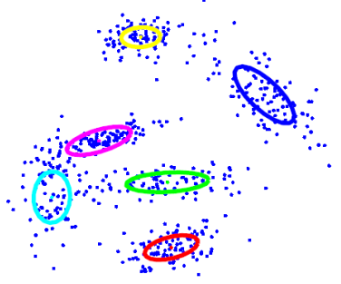
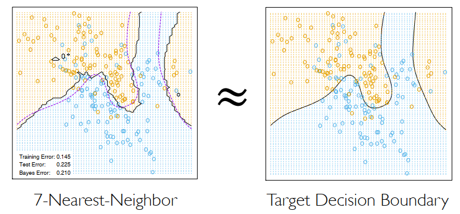
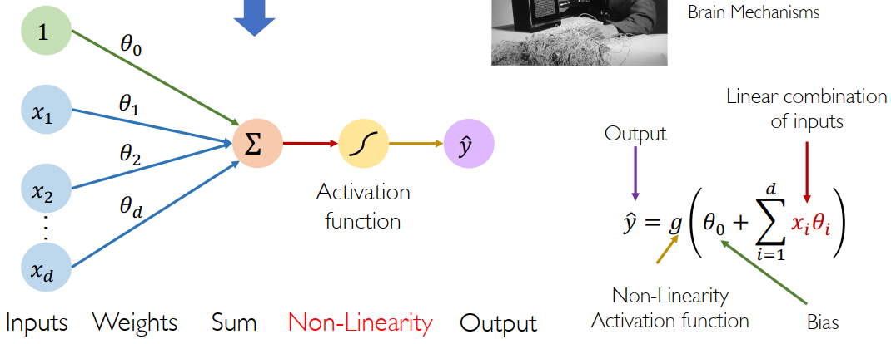
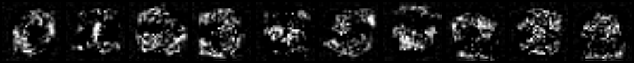
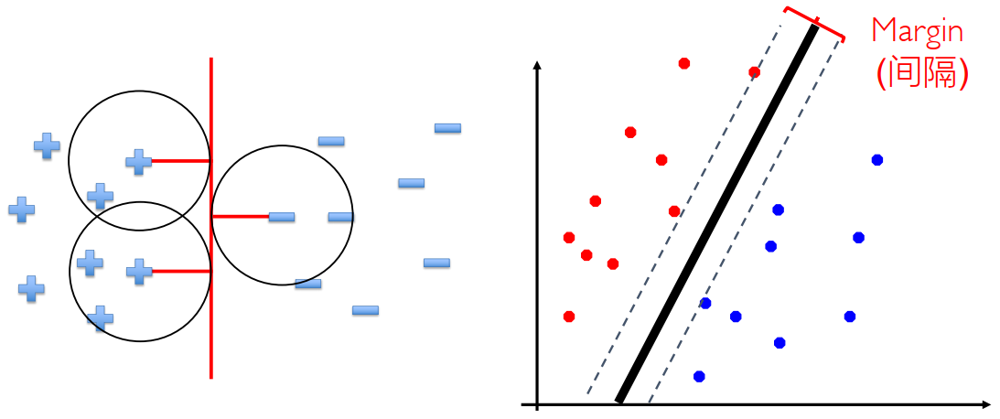

# Project 3: Classification & Clustering

电02 肖锦松 2020010563

## Getting Started

run `python dataClassifier.py –c lr`

该命令调用Linear Regression Classifier，运行结果如下，准确率为77.9%. 该分类器的实现在`LinearRegressionClassifier.train/classify` in `classifiers.py`。

```
Doing classification
--------------------
data:           digits
classifier:             lr
training set size:      5000
Extracting features...
Training...
Validating...
807 correct out of 1000 (80.7%).
Testing...
779 correct out of 1000 (77.9%).
```

这个分类器的目标函数为$\text{min}\|Y-W^TX\|_F^2+\frac{\lambda}{2}\|W\|_F^2$

解析解为：$\text{W}=(XX^T+\lambda I)^{-1}XY^T$

对每个特征向量x，我们有评估函数：$\operatorname{score}(x,y)=\|y-W^Tx\|^2$

MNIST数据集：每个数据为28\*28=784灰度数字图像，并且所有功能和标签都是numpy格式。

## Question 1: K-Means clustering (4 points)

K-Means算法简单过程如下：

Initialize: $\mu_j\leftarrow\text{Random}(\boldsymbol{x}_i),j=1,...,k$

Repeat until convergence: （首先定义特征$x,y$之间的距离：$\operatorname{dist}(x,y)=\|x-y\|^2$）

- Compute cluster assignment (labels): $y_i=h(\boldsymbol{x}_i)=\underset{j}{\operatorname{argmin}}\left\|\boldsymbol{\mu}_j-\boldsymbol{x}_i\right\|_2^2,i=1,...,n$
- Compute means: $\mu_j\longleftarrow\mathrm{Mean}(\{\boldsymbol{x}_i|y_i=j\}),j=1,...,k$



---

在完成作业的过程中，我发现充分了解数据变量的shape非常重要，既有助于帮助我们理解数据的意义，也能够避免进行维度错误的计算。数据变量的shape情况如下：

- `trainingData`: n x dim，用于训练的数据一共n个，每个数据为dim元；
- `cluster_no`: n x 1，表示当前每个训练数据对应的簇标号；
- `self.clusters`: k x dim，对应k个簇中心。

算法的实现主要是利用Numpy库中的函数来完成，其中计算特征之间的dist比较困难。由于$\mu_j$与$x_i$二者维度不同，可以将`trainingData` reshape 为(n, 1, dim)，而将`self.clusters` reshape 为(1, k, dim)，二者相减得到维度为(n, k, dim)的差向量，该差向量只需要在`ord = 2, axis = 2的`条件下求范数即可得到特征之间的dist。

## Question 2: KNN classifier (3 points)

K-Nearest-Neighbors (KNN)算法原理为: Find 𝑘 nearest neighbors of 𝒙. Label 𝒙 with the majority label within the 𝑘 nearest neighbors. 其中，特征$x,y$之间的距离：$\operatorname{dist}(x,y)=\|x-y\|^2$



---

数据变量的shape情况如下：

- ` self.trainingData`: training(5000)  x dim(784)，用于训练的数据一共5000个，每个数据为784元。
- `data`: training(5000)  x dim(784)，表示验证集的数据，一共有5000个，每个数据为784元（即像素个数）
- `dist`:  validation(1000) x training(5000)，`dist[i][j]`就代表距离`(validationData[i] - trainingData[j])^2`

但在这里使用question1的方法计算dist，会开辟出一个大小为(1000, 5000, 786)float数组，这会造成**内存问题**。因此我们只能采用循环，每次对一个验证集数据到所有训练数据的dist，然后根据knn算法算出该验证集数据的预测label，最后返回一个大小为1000的label数组。

run `python dataClassifier.py –c knn –n 5`

该命令调用KNN Classifier，运行结果如下，准确率为91.0%. 

```
data:           digits
classifier:             knn
training set size:      5000
Extracting features...
Training...
Validating...
917 correct out of 1000 (91.7%).
Testing...
910 correct out of 1000 (91.0%).
```

## Question 3: Perceptron (or Softmax Regression) (4 points)



Perceptron算法如下：

Test perceptron algorithm with5000 training data, 1000 validation data and 1000 test data.

Perceptron
$$
\begin{array}{c}t=f(x)=g\left(W^Tx+b\right)=[f_1(x),...,f_i(x)]^T\\ f_i(x)=g_i(w_i^Tx+b_i)\end{array}
$$
The output of 𝑓(𝑥) can be regarded as the following multinomial distribution:
$$
p(y=i|x)=f_i(x)=\frac{e^{w_i^T x+b_i}}{\sum_{j=1}^l e^{w_j^T x+b_j}}
$$
Weight and bias is updated as follows:
$$
w_j^{(t+1)}=w_j^{(t)}-\eta\lambda w_j^{(t)}-\frac{\eta}{k}\sum_{i=1}^k\nabla_{w_j}-\log p(y=y_i|x_i)|_{w_j=w_j^{(t)}} \\

 b_j^{(t+1)}=b_j^{(t)}-n\lambda b_j^{(t)}-\frac{\eta}{k}\sum_{i=1}^k\nabla_{b_j}-\log p(y=y_i|x_i)|_{y_j=a_j^{(t)}}
$$
where:
$$
\nabla_{w_j}-\log p(y=y_i|x_i)=\left\{\begin{matrix}p(y=j|x_i)x_i,j\neq y_i\\ (p(y=j|x_i)-1)x_i,j=y_i\end{matrix}\right. \\

\nabla_{b_j}-\log p(y=y_i|x_i)=\left\{\begin{matrix}p(y=j|x_i),j\neq y_i\\ p(y=j|x_i)-1,j=y_i\end{matrix}\right.
$$
根据上述公式计算$p(y=j|x_i)$，以及更新权重$w$ 和偏置$b$ 即可。

---

run `python dataClassifier.py –c perceptron`

该命令调用Perceptron Classifier，运行结果如下，准确率为87.7%. 

```
data:           digits
classifier:             perceptron
training set size:      5000
Extracting features...
Training...
Starting iteration  0 ...
Starting iteration  10 ...
Starting iteration  20 ...
Starting iteration  30 ...
Starting iteration  40 ...
Validating...
902 correct out of 1000 (90.2%).
Testing...
877 correct out of 1000 (87.7%).
```

Which following images is most likely represent the weights learned by the perception?

(a) 可以发现a 中对应的是一个”相对模糊“的手写数字，而b 中对应的是比较清晰的手写数字，对于一个训练后的模型，权重图实际上表示的是每个输入像素对于输出类别的重要程度，训练的模型需要识别不同人写出的不同样子的数字，因此权重图不可能如同b 一样这么清晰。b 可能对应的是刚开始训练时的权重图，而a 则对应训练结束后的权重图。实际权重图如下：



## Question 4: SVM with sklearn (2 points)



SVM算法：基于训练集D在样本空间中找到一个划分超平面，将不同类别的样本分开。这个超平面需要满足间隔最大这个条件。
$$
\begin{array}{c}\max_{w,b} \text{margin}(w,b)\\ \text{s.t.}y_i(w-x_i+b)\geq1,1\leq i\leq n\end{array}
$$
等价于：
$$
\min_{w,b}\frac{1}{2}{||w||^2_2}\\
s.t. y_i(wx_i+b) \ge 1, 1\le i\le n\\
$$
用拉格朗日法求解其对偶问题，拉格朗日函数为：
$$
L\bigl(\boldsymbol{w},b,\boldsymbol{\alpha}\bigr)=\frac{1}{2}\left\|\boldsymbol{w}\right\|^2+\sum_{i=1}^{m}\alpha_i\left(1-y_i\left(\boldsymbol{w}^T\boldsymbol{x}_i+b\right)\right)
$$
令其偏导数为零，得到两个关系式，带入原式有：
$$
\max&\sum_{i=1}^m\alpha_i-\frac{1}{2}\sum_{i=1}^m\sum_{j=1}^m\alpha_i\alpha_j y_i y_j\boldsymbol{x}_i^T\boldsymbol{x}_j\\ s.t.&\sum_{i=1}^m\alpha_i y_i=\boldsymbol{0},\alpha_i\geq0
$$
也就是任务指导书中给定的优化问题：
$$
\min_\alpha\frac{1}{2}\alpha^TA\alpha-\mathbf{1}^T\alpha\\ \text{s.t.}\begin{matrix}y^T\alpha=0\\ 0\leq\alpha_i\leq C\end{matrix}
$$

---

implement a SVM algorithm with the following hyperparameters:

$C=5$

kernel type: ${RBF}(K(x,y)=\exp-\frac{(x-y)^2}{2\sigma^2})\quad\text{with}\ \sigma=10$

在sklearn的SVM函数中，关键函数就是` sklearn.svm.SVC(*, C=1.0, kernel='rbf', degree=3, gamma='scale', coef0=0.0, shrinking=True, probability=False, tol=0.001, cache_size=200, class_weight=None, verbose=False, max_iter=-1, decision_function_shape='ovr', break_ties=False, random_state=None)`

题目与注释中要求设置四个参数，其中直接设置`c=5.0`，`kernel='rbf'`，`decision_function_shape='ovr'`，对于RBF函数，`K(x, x') = exp(-gamma * ||x - x'||^2)`，因此`gamma`参数直接设置为`gamma=1/(2*(10.0)**2)`。

The relationship between the gamma parameter in the API and σ in original RBF
$$
\text{gamma}=\frac{1}{2\sigma^2}
$$

---

run `python dataClassifier.py –c svm`，最终正确率为93.1%

```
Doing classification
--------------------
data:           digits
classifier:             svm
training set size:      5000
Extracting features...
Training...
Validating...
944 correct out of 1000 (94.4%).
Testing...
931 correct out of 1000 (93.1%).
```


## Question 5: Better Classification Accuracy (2 points + 1 bonus)

起初采用SVM模型，并且反复改进超参数后训练出来的最终正确率为94.8%，于是决定采用神经网络模型，经过反复改进超参数可以达到95.6%的正确率。

整体基于多层感知机（Multilayer Perceptron，MLP）模型，也就是前馈神经网络（Feedforward Neural Network）模型。经过尝试发现设置2个隐藏层，每层均为256个神经元，同时`batch_size`设置为16。

run `python dataClassifier.py –c best`，最终正确率为95.6%

```
Doing classification
--------------------
data:           digits
classifier:             best
training set size:      5000
Extracting features...
Training...
Validating...
Testing...
956 correct out of 1000 (95.6%).
```

