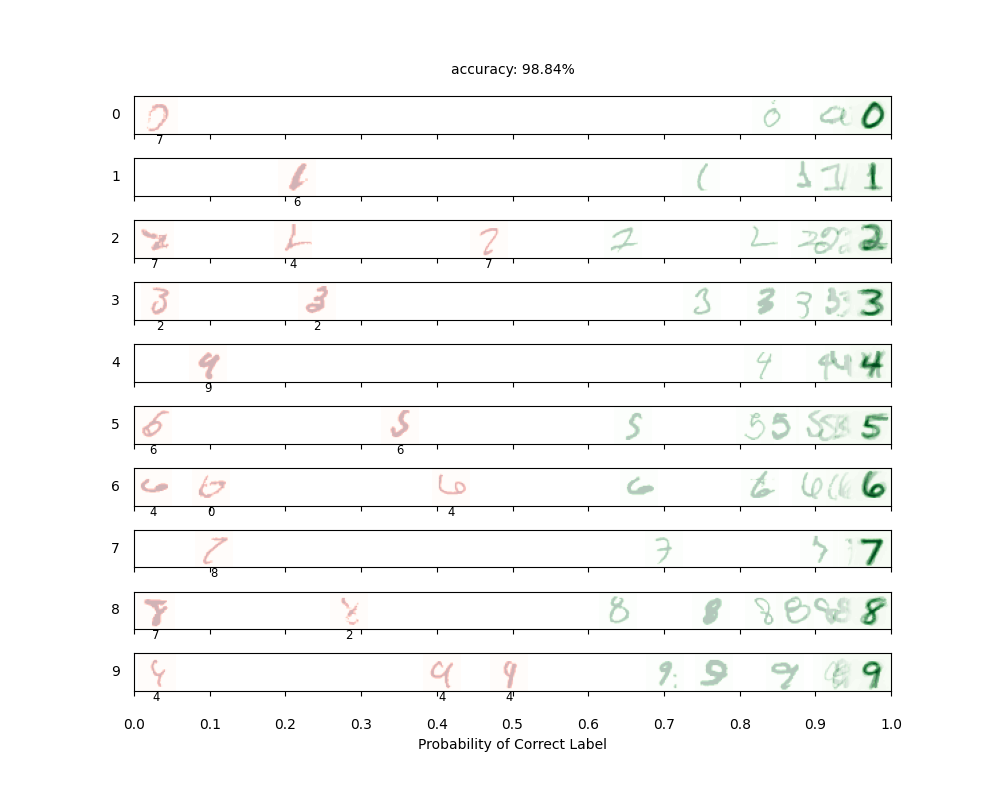
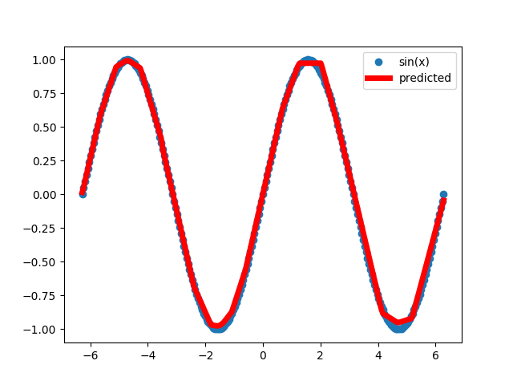
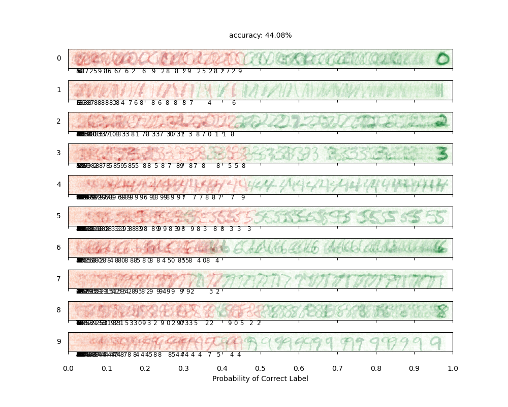

# Project 4: Deep Learning  

电02 肖锦松 2020010563

## Task 1: Digit Classification (4 points)  

由于指导书中已经把5层卷积神经网络，优化器以及损失提供给我们，我们只需要在给定代码框架中将这一神经网络实现。

- `__init__()`中用来定义卷积层、归一化、池化层、全连接层及其参数。其中需要进行计算的为全连接层的`in_features`参数，输入阶段图像大小为(1, 28, 28)，由于缺乏padding，经过卷积层1后变为(16, 26, 26)，归一化和激活后再经过卷积层2，同理变为(32, 24, 24)，随后经过归一化和激活后经过池化层2，特征图尺寸变为原先的一半(32, 12, 12)，随后经过卷积层3变为(64, 10, 10)，经过归一化和激活后经过池化层3，特征图尺寸变为原先的一半(64, 5, 5)。因此`in_features=64*5*5`。
- `forward()`中主要就是将每一个层的关系写出来，并不难。
- `train_model()`中利用`PyTorch`中的交叉熵损失函数`nn.CrossEntropyLoss()`以及SGD优化器`optim.SGD`即可，经过几次尝试，优化器的超参数设置为比较常见的`lr=0.02`，`momentum=0.92`，发现效果已经比较好。

结果如下：

可以发现，测试的准确率相对较高，并且置信度扑鼻那大于0.9，只有少数的写的比较潦草的数字会被认错，其中一些数字可能人也会把它看错，因此这个准确率实际上已经是比较高的了。

**Question 1**
What is the role of the BatchNorm layer? Just give ONE aspect you think is important. To answer thisquestion, you may remove all BatchNorm layers and retrain the model, then different classification resultswill get. 

由于深度神经网络包含很多隐含层，每层参数随着训练优化，每个隐藏层会面临内部协变量偏移问题，会使得每层输入不再是独立同分布，这样可能会使数据输入激活函数后落入饱和区，使得学习效率过低，甚至梯度消失，训练收敛越来越慢。而BatchNorm layer的作用是通过归一化手段，将每层输入变换为均值0方差1的标准正态分布，这样使得激活输入值分布在非线性函数梯度敏感区域，避免了梯度消失问题，大大加快训练速度。减少了模型对输入特征规模和分布的以来也能够提高模型的泛化能力。

包含2个BatchNorm layer的神经网络训练结果为：Your final test set accuracy is: 98.84%。反之，没有包含任何BatchNorm layer的神经网络训练结果为：Your final test set accuracy (97.77%)。可以发现缺少了BatchNorm layer的神经网络最终测试的准确率有部分的下降，以至于达不到本题的最低要求98.00%。

## Task 2: Non-Linear Regression (4 points)  

- `__init__()`中定义了神经网络的基本结构，只需要在`forward()`中执行`return self.net(x)`即可。
- `train_model()`中可以模仿`DigitClassificationModel`给出的框架，根据题意，需要将criterion换成MSE loss，选择将optimizer换成adam，其中学习率设置为`lr=0.05`。每个epoch中，除了train，还需要有validation的过程，依次计算并输出每次epoch的验证损失。

结果如下：Your final loss is: 0.000313，远小于所要求的0.02.

## Task 3: Automatic Gradient Computation (3 points)  

`attack()`方法的作用使利用快速符号梯度法（Fast Gradient Sign Method，FGSM）来生成对抗样本，对原始输入数据进行微小扰动，使得模型的预测结果发生变化，但不改变原始数据的标签。步骤如下：

1. 将模型设置为评估模式（eval mode）以确保不进行梯度计算。
2. 对输入数据 `x` 进行克隆，并设置 `requires_grad_()`，以便计算梯度。
3. 将输入数据进行归一化处理，使得数据的取值范围在 [0,1] 之间。
4. 前向传播：通过将归一化后的输入数据输入到模型中，获取模型的预测输出。
5. 清零之前的梯度：将模型参数的梯度置零，以便进行新一轮的梯度计算。
6. 计算损失：使用预测输出和目标标签计算损失值。
7. 反向传播：通过调用 `loss.backward()` 计算输入数据 `x` 相对于损失的梯度。
8. 计算梯度的元素符号：使用 `x.grad.sign()` 获得相对于 `x` 的梯度的元素符号。
9. 创建扰动图像：通过将每个像素点的值调整为原始图像 `x` 加上梯度符号乘以扰动因子 `epsilon`，得到扰动后的图像。
10. 对扰动后的图像进行剪裁，以确保像素值仍在 [0,1] 的范围内。
11. 返回对抗样本。

通过这些代码，可以生成对抗样本，使得原始数据稍作扰动后，模型的预测结果发生改变，从而验证模型的鲁棒性，并提供一种评估和改进分类模型的方法。

生成的对抗样本以及预测结果如下：

**Question 2**
Visualize the adversarial examples in figures/q3.png. Describe what the adversarial examples looklike. Give ONE possible reason for the cause of the adversarial example underlying the neural network.

对抗样本的正确率只有一半不到，这里的对抗样本设置了$\varepsilon=0.2$，已经是比较大的值了，生成的对抗样本实际上发生了较大改变，可以发现一些识别错误的手写数字，实际上人类去判断似乎也是错误的，这说明对抗样本的扰动已经过大。

对抗样本是原始数据的轻微扰动版本，旨在欺骗神经网络模型。尽管看起来与原始数据非常相似，但这些扰动会导致模型产生不正确的预测或对例子进行不同的分类。需要对抗样本的一个可能的原因是，神经网络经常依靠高频成分或特征来进行预测。这些高频特征对输入数据的微小变化可能非常敏感。恶意例子通过添加不易察觉的扰动来利用这种敏感性，从而导致模型对输入进行错误分类。这些扰动可能利用了模型决策过程中的漏洞或盲点，导致不正确的预测。换句话说，神经网络不能很好地泛化，对输入空间的小扰动很敏感，这就使得我们需要用到对抗样本。这种现象突出表明，需要对神经网络模型进行鲁棒性改进，以减轻对抗性攻击的影响。

## Task 4: Language Identification (4 points + 1 bonus)  

自然语言处理中一般是将 字/词 转换成一个one-hot向量，但是one-hot向量维度太高了，所以使用 嵌入层(Embed) 转换成低维的稠密的向量，然后经过RNN层，由于隐层的输出不一定和要求的输出一致，所以最后再加一个线性层。

但是本文是一个分类问题，只需要得到最后的一个隐层，所以简化成下面这样：

进一步简化如下：

