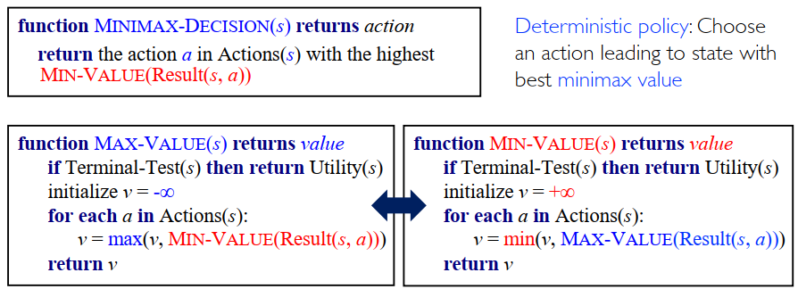
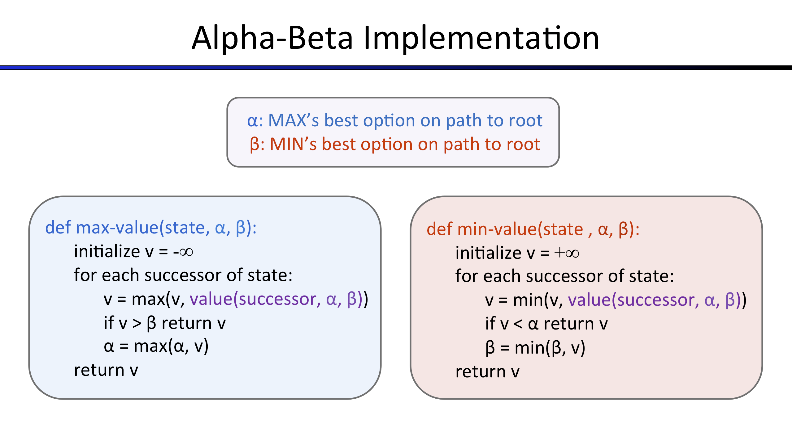
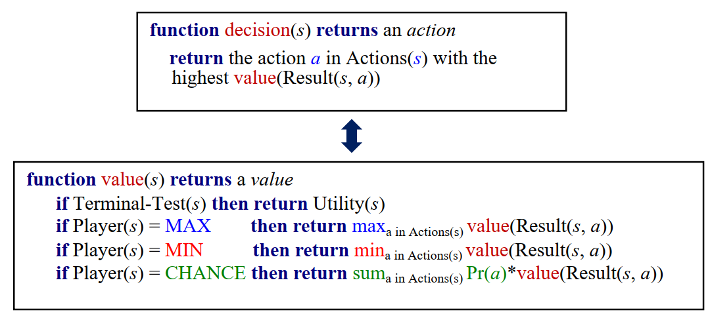

# Project 2: Multi-Agent Search

电02 肖锦松 2020010563

## Question 1: Reflex Agent

本题的要求是Improve the ReflexAgent in multiAgents.py. 具体来说，需要改进的是`ReflexAgent`的Evaluation Function. 先查看`ReflexAgent`原先的`evaluationFunction`，它仅仅是以Agent当前的score来作为评估函数的结果。具体查看了Pacman.py后发现，这个score的基本逻辑大约包括time penalty, eat food等。要想改进评估函数，可以考虑与最近豆子的距离、与最近Ghost的距离。但是仅考虑这两个因素无法达到满意的效果，这是因为Ghost有scared状态，期间他是无法攻击Pacman的，甚至可以被Pacman吃掉，因此此时的Ghost并不会在评估函数起负面作用，反而是起到了正面作用。

初步设置：`return successorGameState.getScore() + foodScore + ghostScore`
`foodScore`为Pacman与最近豆子的距离的倒数
`ghostScore`初值为0，然后减去Pacman与当前所有不处于scared状态的距离之和，加上Pacman与当前所有处于scared状态的距离之和的导数。
此时结果为：Average Score: 1274.9

微调参数：改变foodScore与ghostScore在最终评估分数上的权重，`return successorGameState.getScore() + 2.0*foodScore + 3.0*ghostScore`
此时结果更优为：Average Score: 1310.5


## Question 2: Minimax

本题要求完成`MinimaxAgent`，可以参照minimax算法伪代码进行编程。



这里基本的理解是，Pacman和Ghost交替行动，二者完成一次活动则对应博弈树的深度+1。
函数编写和上述已知：完成`terminalTest`、`maxValue`、`minValue`三个函数的编写，最后需要得到的是第0层开始所有action对应的下一状态中，Ghost的最小值中的最大值。

最后搜寻得到最大的`minValue`对应的action即可。

## Question 3: Alpha-Beta Pruning

本题只需要在Minimax的基础上加上维护$\alpha, \beta$，以及判断语句即可，可以参照指导书给出的伪代码如下：



然后执行下述伪代码：

```python
function Alpha-Beta Search(state) returns an action
	v = maxValue(state, -infty, +infty)
	return the action in ACTIONS(state) with value v
```

评分时有一个错误困扰了我很久，最后发现一个问题，那就是教材上的$\alpha-\beta$剪枝判断条件是$\ge$和$\le$，但是指导页面给的是$<$和$>$。我刚开始用的判断条件是$\ge$和$\le$，但是一直是0/5，因为这样子会导致某些case可能与$<$和$>$剪枝的情况不同，评分器会给出判错，但实际上效果应该类似。


## Question 4: Expectimax

本题中，Ghost不再是遵循minValue函数来行动，而是简化为Random Ghost，所有action服从均匀分布，因此Random Ghost的value可以用所有action的平均值来表示，即sum Pr\*value



从代码上看，只需要在Minimax的基础上把minValue修改为sumPrValue即可。区别在于：

- 原先`minValue`初值为`-float('inf')`，然后通过递归算法选择替换每次action的`min`值；
- 而在`sumPrValue`中，v的初值为`0`，然后通过递归算法累加每次action的value除以action总数的值，最后得到的就是所有action的value均值。

最后求解和minimax相同，搜寻得到最大的`sumPrValue`对应的action即可。


## Comparison

Compare how these agents perform, e.g. state numbers, time, win rate, etc

使用autograder测试三个Agent

```
python autograder.py -q q2 --no-graphics
python autograder.py -q q3
python autograder.py -q q4
```

| Agents           | Average Score | Win Rate   |
| ---------------- | ------------- | ---------- |
| Minimax Agent    | 84.0          | 0/1 (0.00) |
| AlphaBeta Agent  | 84.0          | 0/1 (0.00) |
| Expectimax Agent | 84.0          | 0/1 (0.00) |

minimaxClassic

```
python pacman.py -p MinimaxAgent -l minimaxClassic -a depth=3 -q -n 10
python pacman.py -p AlphaBetaAgent -l minimaxClassic -a depth=3 -q -n 10
python pacman.py -p ExpectimaxAgent -l minimaxClassic -a depth=3 -q -n 10
```

| Agents           | Average Score | Win Rate    |
| ---------------- | ------------- | ----------- |
| Minimax Agent    | -91.8         | 4/10 (0.40) |
| AlphaBeta Agent  | -91.1         | 4/10 (0.40) |
| Expectimax Agent | 208.1         | 7/10 (0.70) |

trappedClassic

```
python pacman.py -p MinimaxAgent -l trappedClassic -a depth=3 -q -n 10
python pacman.py -p AlphaBetaAgent -l trappedClassic -a depth=3 -q -n 10
python pacman.py -p ExpectimaxAgent -l trappedClassic -a depth=3 -q -n 10
```

| Agents           | Average Score | Win Rate    |
| ---------------- | ------------- | ----------- |
| Minimax Agent    | -501.0        | 0/10 (0.00) |
| AlphaBeta Agent  | -501.0        | 0/10 (0.00) |
| Expectimax Agent | 221.8         | 7/10 (0.70) |

总体而言，Alpha-beta pruning算法是在Minimax算法基础上的优化，可以很好地减少搜索空间的大小，并且比Minimax算法更快地找到解决方案。但是针对本项目应该是评估函数写得不过好，有时候还是会失败。

Expectimax算法适用于处理概率分布和不确定性，但是它的效率和稳定性相对较低。比如在一些情况下采用Expectimax算法，Win Rate在0.2~0.7之间波动。


## Question 5: Evaluation Function

评估函数应该评估状态，而不是像`ReflexAgent`中的`evaluationFunction`那样评估当前状态及行动。

`evaluationFunction`利用当前状态及行动求出下一状态，然后评估下一状态，现在我们只需要评估当前状态则更为直接，直接把`evaluationFunction`中评估下一状态的方法拷贝过来评估当前状态即可，调节foodScore和ghostScore权重，得到一个比较大的分数。

最终发现这样的权重较为合适，得分Average Score: 1187.9

`return currentGameState.getScore() + 10*foodScore + 10*ghostScore`
