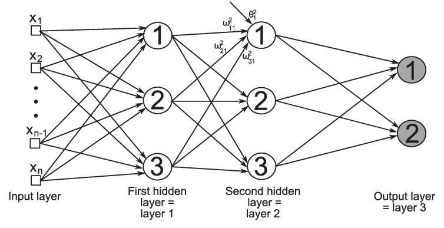

# Project 5: Machine Learning

电02 肖锦松 2020010563

## Question 1 (6 points): Perceptron

Linear Classifiers的执行过程如下：
$$
\text{activation}_w(x)=\sum\limits_i w_i\cdot f_i(x)=w\cdot f(x)
$$

Learning: figure out the weight vector from examples

$$
\begin{array}{l}
h_w(x)=1, \quad \text{if}\ w_0+w_1x\geq0\\ 
h_w(x)=-1,\quad \text{if}\ w_0+w_1x<0
\end{array}
$$
A learning problem is **linearly separable** iff there is some hyperplane exactly separating positive from negative examples. 

The perceptron learning rule does this: $w\leftarrow w+\alpha(y-h_w(x))x$

只需要了解以下函数的作用即可完成上述过程。

- `get_weights(self)`: 返回当前perceptron的 $w$，数据类型是`Parameter`类
- `run(self, x)`: 返回包含当前perceptron对数据点 $x$ 的分数的Node，也就是$w\cdot x$，这时候只需用到`nn.DotProduct`
- `get_prediction(self, x)`: 只需要根据$w\cdot x$ 的计算结果，返回分类结果$h_w(x)$ = $1$ or $-1$即可，但是`run`函数返回的是Node类，需要用`nn.as_scalar`将其转换为标量（在这里是float）
- `train(self)`: 在数据集中进行循环，分类错误则进行update，直到没有任何错误退出循环。
- `parameter.update(direction, multiplier)`: 对感知机中$x$ 对应的权重$w$ 进行更新，weights←weights+direction⋅multiplier
  The `direction` argument is a `Node` with the same shape as the parameter, and the `multiplier` argument is a Python scalar. 

在进行权重更新的时候，一般而言可以考虑如下公式$w\leftarrow w+\alpha(y-h_w(x))x$，这里需要注意由于这是二分类问题，$y$ 的取值为${1,-1}$，但发现学习率需要设置为0.5才能通过。这里有点费解。

---

The best learning rate may be different depending on the batch size.

Recommended values for your hyperparameters:

- Hidden layer sizes: between 10 and 400.
- Batch size: between 1 and the size of the dataset. For Q2 and Q3, we require that total size of the dataset be evenly divisible by the batch size.
- Learning rate: between 0.001 and 1.0.
- Number of hidden layers: between 1 and 3.

## Question 2 (6 points): Non-linear Regression

Non-linear Regression过程如下，本题选择three-layer net，表达式和示意图如下所示：

$$
\mathbf f(\mathbf x)=relu(relu(\mathbf x\cdot\mathbf W_1+\mathbf b_1)\cdot\mathbf W_2+\mathbf b_2)\cdot\mathbf W_3+\mathbf b_3\quad\text{}
$$

注意：第$i$ 层的权重$w_i$ 的维度为$n_{i-1} \times n_i$，偏置$b_i$ 的维度为$1 \times n_i$。

利用Gradient Ascent方法更新权重$w$：$w\leftarrow w-\alpha*\nabla_w g(w)$

## Question 3 (6 points): Digit Classification

思路、代码与上一题基本类似，我还是选择采用三层神经网络。

## Question 4 (7 points): Language Identification

本题的模型如下图所示

根据上图模型，我们可以知道其计算公式如下：
$$
h_1=x_0\cdot\textbf{W}\\
h_{i+1}=x_i\mathbf{W}+h_i\mathbf{W}_{\text{hidden}}
$$
