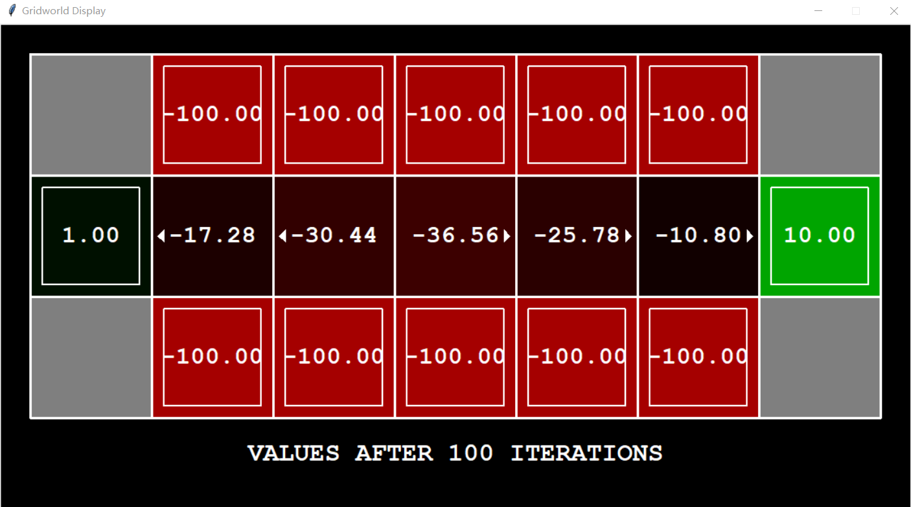

# Project 6: Reinforcement Learning

电02 肖锦松 2020010563

## Question 1: Value Iteration

`computeQValueFromValues`: Q Value的计算公式为：
$$
\begin{aligned}Q(s,a)&=\sum_{s'}P(s'|s,a)[R(s,a,s')+\gamma U(s')]\\ &=\sum_{s'}P(s'|s,a)[R(s,a,s')+\gamma\underset{a'}{\text{max}}Q(s',a')]\end{aligned}
$$
用`mdp`的接口函数即可求解Q Value

- `mdp.getTransitionStatesAndProbs(state, action)`可以求得上式的$s'$与$P(s'|s,a)$
- `mdp.getReward(state, action, nextState)`可以得到$R(s,a,s')$
- `self.discount`存储着$\gamma$的值
- `self.values[nextState]`存储着$U(s')$的值

`computeActionFromValues`: 即policy extraction的过程，选择对应Q值最大的action即可。
$$
\pi_U(s)=\text{argmax}_a\sum_{s'}P(s'\big|a,s)[R(s,a,s')+\gamma U(s')]
$$

- `mdp.getPossibleActions(state)`可以求出当前state下可能的action

`runValueIteration`: Value Iteration的过程为：
$$
U_{k+1}(s)\leftarrow\max_{a}\sum_{s'}P(s'\mid a,s)[R(s,a,s')+\gamma U_k(s')]\\
\text{U}_{k+1}\leftarrow\text{BU}_k
$$
需要迭代更新所有state对应的Value，迭代次数定义在`self.iterations`。需要注意MDP中没有可用操作的情况，需要将$U_{k+1}(s)$置零。

## Question 2: Bridge Crossing Analysis

运行`python gridworld.py -a value -i 100 -g BridgeGrid --discount 0.9 --noise 0.2`后

- discount（折扣因子）是用于衡量未来奖励的价值相对于当前奖励的价值的，通常取值在0和1之间。当discount接近0时，代表当前奖励的价值比未来奖励的价值更重要，强化学习算法更加注重立即的奖励；当discount接近1时，代表未来奖励的价值更重要，强化学习算法更加注重长期奖励。因此，当discount的取值改变时，会影响强化学习算法对于当前奖励和未来奖励的重视程度，进而影响算法的性能。
- noise（噪声）是指由于外界因素的影响，导致强化学习算法在执行某个动作时不一定能够获得完全一致的奖励。在Q-learning等强化学习算法中，通常会引入噪声，以提高算法的鲁棒性和泛化能力。当noise的取值较大时，代表强化学习算法在执行某个动作时获得的奖励不太可信，算法更倾向于探索未知的状态和动作，进而影响算法的收敛速度和结果；当noise的取值较小时，代表强化学习算法在执行某个动作时获得的奖励相对稳定，算法更倾向于利用已知的信息来进行决策，进而影响算法的探索程度和鲁棒性。

要让Agent过桥，则我们更加关注未来的奖励，并且希望受桥两边负奖励的影响较少，因此可以增大discount，或是减小noise，实际上发现增大discount作用并不明显，仍然无法让Agent过桥，只能选择减小noise，最终修改noise为0.001.

## Question 3: Policies

Prefer the close exit要求我们更加关注当前的奖励，未来的奖励占比较小，因此我们需要减小discount。Prefer the distant exit则相反，需要较大的discount，二者都需要较少的noise。

risking the cliff则需要减少living reward，否则Agent会在第一步就向北走，avoiding the cliff则要求更大的living reward

Avoid both exits and the cliff则需要增大noise。

- Prefer the close exit (+1), risking the cliff (-10)
  `python gridworld.py -a value -i 100 -g DiscountGrid -d 0.3 -n 0.005 -r 0.1`
- Prefer the close exit (+1), but avoiding the cliff (-10)
  `python gridworld.py -a value -i 100 -g DiscountGrid -d 0.2 -n 0.02 -r 0.2`

- Prefer the distant exit (+10), risking the cliff (-10)
  `python gridworld.py -a value -i 100 -g DiscountGrid -d 0.95 -n 0.02 -r 0.2`
- Prefer the distant exit (+10), avoiding the cliff (-10)
  `python gridworld.py -a value -i 100 -g DiscountGrid -d 0.95 -n 0.02 -r 0.4`
- Avoid both exits and the cliff (so an episode should never terminate)
  `python gridworld.py -a value -i 100 -g DiscountGrid -d 0.9 -n 0.8 -r 0.2`

## Question 4: Asynchronous Value Iteration

 Asynchronous Value Iteration与常规的Value Iteration不同的地方在于：每次迭代中只更新**一个**状态

只需要在Value Iteration的代码中去除对state的遍历，改为每次迭代中更新一个状态，可以采用最简单的顺序更新。

## Question 5: Prioritized Sweeping Value Iteration

按照指导编程即可完成。

Prioritized Sweeping Value Iteration与常规的Value Iteration不同的地方在于：优先更新具有最大误差的状态，可以更加高效地更新状态的值函数。

## Question 6: Q-Learning

`update`过程如下：
$$
 sample=R(s,a,s')+\gamma\max\limits_{a'}Q(s',a')\\
 Q(s,a)\leftarrow(1-\alpha)Q(s,a)+(\alpha)\left[sample\right]
$$

## Question 7: Epsilon Greedy

Q-learning中的`getAction`为random actions (ε-greedy)

- With (small) probability $\varepsilon$, act randomly
- With (large) probability $1-\varepsilon$, act on current policy

## Question 8: Bridge Crossing Revisited

在强化学习中，epsilon和learning rate是两个重要的超参数，分别用于控制探索和更新策略。

- Epsilon是一种用于平衡探索和利用之间的权衡的策略。在强化学习中，探索是指随机选择行动以探索新状态的过程，而利用是指选择已知最佳策略的行动。Epsilon负责控制探索的程度，即决定算法在选择行动时会有多大的概率随机选择未被探索的行动。一般来说，当epsilon较大时，算法更倾向于探索未知的状态-动作对，而当epsilon较小时，则更倾向于利用已知的最佳策略。

- Learning rate是指算法更新策略的速率。在强化学习中，每次选择行动后，会对当前的Q值进行更新。而这个更新的速率就是由learning rate来控制的。如果学习速率过大，可能导致更新过于频繁，无法达到收敛的状态；如果学习速率过小，则可能需要很长时间才能达到最优解。通常来说，选择一个适当的学习率是非常重要的，可以通过试错法来寻找最佳的学习率。

发现epsilon = 0.5, learning rate = 0.5时，Agent在50 episodes中才往右探索了两步，二者均需要增大，但最终：`"NOT POSSIBLE"`

## Question 9: Q-Learning and Pacman

Pacman在训练1000次左右后，吃豆人的reward变为正，这说明Pacman已经开始

## Question 10: Approximate Q-Learning

Approximate Q-Learning的过程如下：
$$
\begin{array}{l}
\text{transition}=(s,a,r,s')\\ \text{different}=\left[r+\gamma\max_a\times Q(s',a')\right]-Q(s,a)\\ 
Q(s,a)\leftarrow Q(s,a)+\alpha\text{[differentence]}\\ 
w_i\leftarrow w_i+\alpha\text{[difference]}f_i(s,a)
\end{array}
$$

